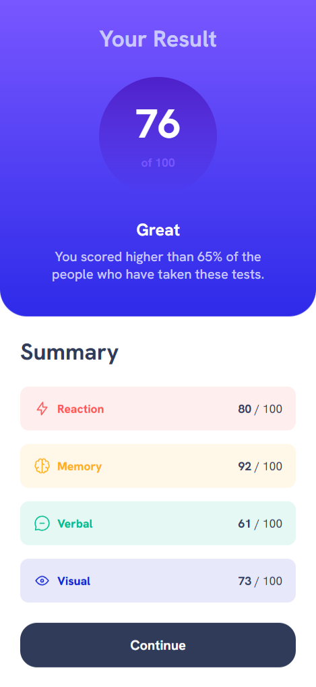

# Frontend Mentor - Results summary component solution

This is a solution to the [Results summary component challenge on Frontend Mentor](https://www.frontendmentor.io/challenges/results-summary-component-CE_K6s0maV). Frontend Mentor challenges help you improve your coding skills by building realistic projects. 

### The challenge

Users should be able to:

- View the optimal layout for the interface depending on their device's screen size
- See hover and focus states for all interactive elements on the page
- **Bonus**: Use the local JSON data to dynamically populate the content

### Screenshots

<table>
  <tr>
    <td></td>
    <td></td>
  </tr>
</table>

### Links

- Solution URL: https://www.frontendmentor.io/solutions/results-summary-component-with-sass-4F7u6xebVQ
- Live Site URL: https://mzdemir-results-summary-component.netlify.app/

### Built with

- Semantic HTML5 markup
- Sass
- CSS Grid
- Mobile-first workflow
- Accessibility

## Author

- Website - https://github.com/mzdemir
- Frontend Mentor - https://www.frontendmentor.io/profile/mzdemir